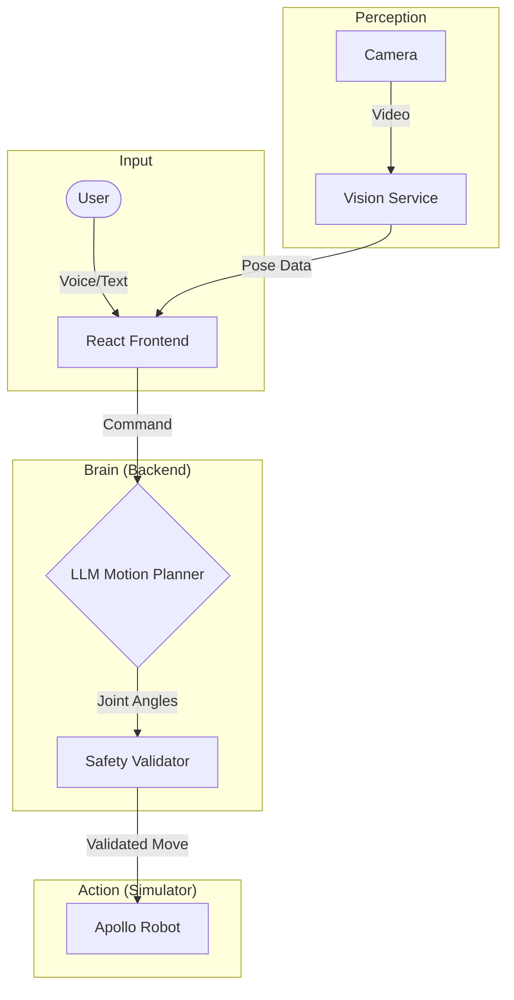

# Research Progress Report: CORAL Voice AI Agent

This report summarizes the progress on the **CORAL (Conversational Robot Action Learning)** project, a multimodal AI dialogue agent designed to ground natural language instructions into executable robot motions for child-robot interaction.

---

## 1. Project Overview
The goal of this project is to enable natural, conversational control of an **Apptronik Apollo humanoid robot**. We address the challenge of "geometric grounding"—bridging the gap between vague human speech (e.g., "move it up a bit") and precise robotic joint angles—using a multi-stage LLM architecture and real-time vision feedback.

## 2. Completed Technical Milestones

### A. Robot Simulation & Motion Planning
*   **MuJoCo Integration**: Successfully integrated the Apptronik Apollo humanoid model within a MuJoCo simulation environment, featuring independent control of head, torso, and arms.
*   **Parameterized Motion Primitives**: Developed a library of 14+ primitives (e.g., `head_turn`, `arm_out`, `torso_lean`) that accept dynamic parameters like angle, direction, and speed.
*   **Social Gesture Library**: Implemented complex, multi-keyframe animations for social interaction, including waving, nodding, and pointing.
*   **Safety & Validation**: Built a validation layer to enforce joint limits and verify the "direction" of motion against user intent (e.g., preventing the robot from moving left when the user says "right").

### B. Conversational AI Stack
*   **Motion Planner LLM**: Implemented a specialized router using GPT-4o-mini that performs **Chain-of-Thought reasoning** to select the correct primitives and parameters from natural language.
*   **Hierarchical Memory Management**: Developed a three-tier memory system:
    *   *Short-term*: Full detail of recent exchanges.
    *   *Mid-term*: Summarized history for long-term context.
    *   *Action History*: Structured log of robot waypoints to enable "undo" and repair commands.
*   **Voice Interface**: Integrated **OpenAI Whisper** for real-time transcription of voice instructions, enabling a hands-free interaction loop.
*   **Observability**: Fully integrated **Langfuse** for tracing every LLM decision, allowing us to debug "hallucinated" primitives or reasoning errors.

### C. Vision & Perception Service
*   **Head Pose Estimation**: Built a custom vision service (Python/FastAPI) using MediaPipe to solve the 3D Perspective-n-Point (PnP) problem, providing precise Yaw, Pitch, and Roll of the user's head.
*   **Adaptive Filtering**: Implemented **OneEuroFilters** to eliminate jitter in tracking while maintaining high responsiveness for fast movements.
*   **Calibration System**: Created a calibration workflow that allows the system to learn a user's unique "neutral" pose, improving the accuracy of relative motion commands.

---

## 3. System Architecture

---

## 4. Visual Progress

### Robot Simulation & Chat Interface
> **[PLACEHOLDER: Insert Video 1 - Demonstrating the robot executing a sequence of commands like "Look at me and wave your right arm"]**

### Real-time Pose Tracking
> **[PLACEHOLDER: Insert Screenshot 1 - The 3D Skeleton view in the frontend showing the Three.js reconstruction of the user's pose]**

### Head Orientation Gauges
> **[PLACEHOLDER: Insert Screenshot 2 - The 'Head Orientation' UI panel showing real-time Yaw/Pitch/Roll gauges during interaction]**

---

## 5. Summary of Current Capabilities
| Feature | Implementation | Status |
| :--- | :--- | :--- |
| **Humanoid Model** | Apptronik Apollo (MuJoCo) | ✅ Complete |
| **Voice Transcription** | Faster-Whisper | ✅ Complete |
| **Motion Planning** | CoT LLM Router | ✅ Complete |
| **3D Vision** | MediaPipe + PnP Solver | ✅ Complete |
| **Memory/Context** | Hierarchical JSON Store | ✅ Complete |
| **Observability** | Langfuse Tracing | ✅ Complete |

## 6. Next Steps
*   **Fine-tuning**: Transition from GPT-4o-mini to a fine-tuned **Llama 3.2 (8B)** model specialized in child-robot dialogue patterns.
*   **Latency Optimization**: Reducing the "Time to Action" by optimizing the vision-to-backend-to-simulator pipeline.
*   **Grounding Repairs**: Improving the agent's ability to handle ambiguous instructions through proactive clarification questions.
